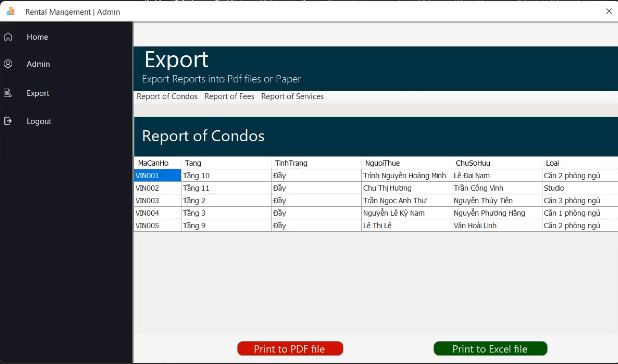
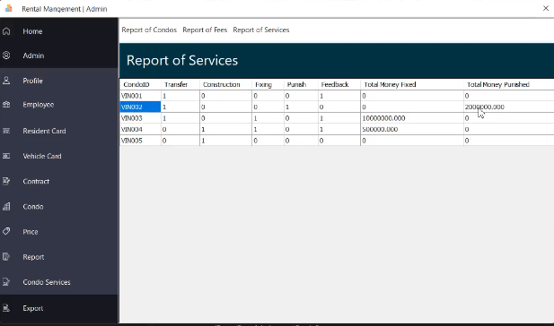
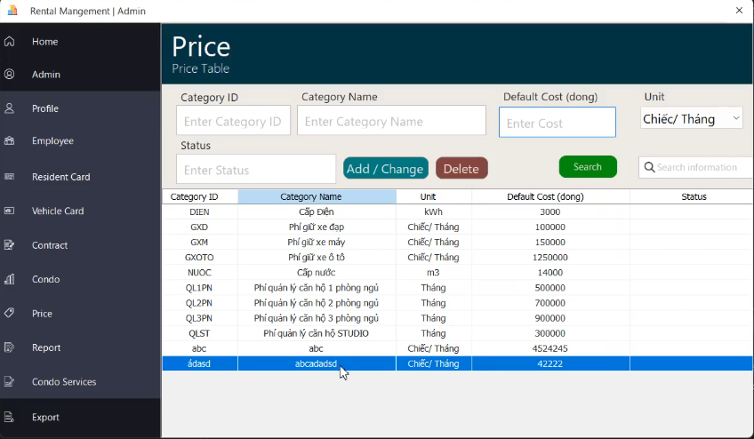

# 🏢 Condo Management System - Admin Panel

> A desktop application for managing condominium-related data, including residents, services, pricing, and reports export in PDF/Excel formats.

## 📌 Key Features

### 1. 📊 Condo Report Export
- Manage a list of condos including: Condo ID, Floor, Status, Tenant, Owner, and Type.
- Export reports as **PDF** or **Excel** files.

---

### 2. 🧾 Services Report
- Track service usage such as: Transfers, Construction, Repairs, Penalties, and Feedback.
- Calculate total fixed costs and penalty costs for each condo.

---

### 3. 💸 Service Pricing Table
- Manage fee categories: electricity, water, parking, and condo management by room type.
- Add/Edit/Delete categories with units and default prices.

---

## 🛠️ Technologies Used

- Programming Language: C# (Windows Forms)
- Database: SQL Server
- Reporting: Export to PDF & Excel
- UI: Admin-friendly and clean design

---

## 👨‍💻 Developer

- Software Engineering Student
- Roles: Main Developer, Tester

---

## 📬 Contact

For any questions or feedback, please contact: **your.email@example.com**

---

> 📌 *This project was developed as a practice for software development and testing. Ideal for academic projects or demo purposes.*
